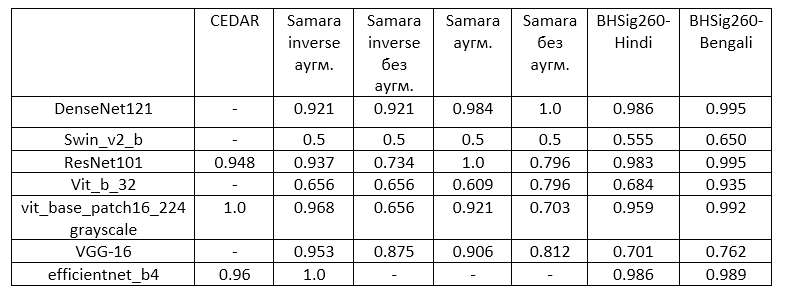
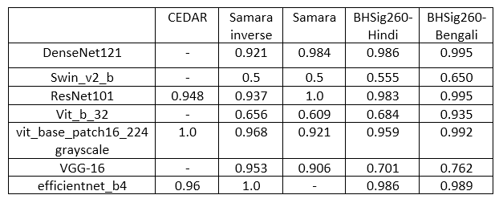
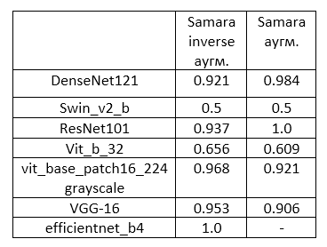
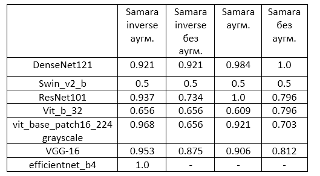

## Постановка задачи:
Во входных данных имеется N подлинных и (в идеале) столько же N поддельных подписей. В процессе обучения, нейронная сеть должна научиться определять подлинные подписи от поддельных (т.е. задача бинарной классификации).

## Описание баз данных
«Samara» - созданная база данных в процессе выполнения задания. Состоит из 320 подписей, в создании которых принимало участие 10 человек: от каждого из них было собрано по 16 подлинных и 16 поддельных подписей. Каждая подпись была отсканирована с разрешением 300 DPI.

«CEDAR» - одна из самых часто используемых баз данных. На каждого из 55 участников в датасете приходится 24 подлинные и 24 поддельные подписи. Т.е. в базе данных присутствует 1320 подлинных и 1320 поддельных подписей. Каждая подпись была отсканирована с разрешением 300 точек на дюйм (DPI), а также использовалась нормализация и удаление шумов.

«BHSig260» — база данных бенгальского и хинди языков. Для бенгальского в базе данных присутствуют подписи от 100 человек, а от языка хинди — 160. Для каждого человека в базе данных находится 24 подлинных подписи и 30 поддельных. Таким образом, «BHSig260» содержит 6240 подлинных подписей и 7800 поддельных. Каждая подпись сделана с разрешением 300 DPI и форматом TIF. В ходе выполнения экспериментов, подписи бенгальского и хинди языков были разделены, формируя тем самым базы данных «BHSig260-Bengali» и «BHSig260-Hindi».


# Сводная таблица всех экспериментов по метрике Accuracy



## Общее описание экспериментов
Количество эпох варьировалось от 70 до 200 в зависимости от производительности модели и скорости уменьшения Loss функции.

В качестве функции потерь была выбрана CrossEntropyLoss;

Оптимизация производилась с помощью стохастического градиентного спуска с learning rate близким к 1e-4 и momentum в промежутке [0.2;0.9].

Нейронные сети (кроме vit_base_patch16_224) обучались с нуля, без pretrained весов. 

# Эксперимент 1 - сравнение CNN и трансформерных нейросетей


Из данной таблицы видно, что, при обучении с нуля, нейронные сети трансформерного типа (Vit_b_32, Swin_v2_b) справляются хуже с задачей, чем CNN.

Однако заранее натренированная модель ViT трансформера в целом имеет такой же уровень метрик, как и остальные CNN.


Эксперимент проводился следующим образом: каждая из баз данных делилась в соотношении 80/20 для создания обучающей и тестовой выборки соответственно.

К тестовой выборке последовательно применялись следующие преобразования:
- Изменение размера до N x N;
- Вырезка изображения по центру размера L x L;
- Преобразование в тензор и масштабирование значений в диапазон [0; 1] ;
- Нормализация значений к нужным мат.ожиданиям M и среднеквадратическим отклонениям sigma.
Параметры N, L, M и sigma зависят от конкретной модели нейронной сети.
Например, для модели DenseNet121 преобразования будут следующими:
- Изменение размера до 256 x 256 ;
- Вырезка изображения по центру размера 224 x 224;
- Преобразование в тензор и масштабирование значений в диапазон [0; 1] ;
- Нормализация значений к нужным мат.ожиданиям [0.485, 0.456, 0.406] и среднеквадратическим отклонениям [0.229, 0.224, 0.225].

К обучающей выборки последовательно применялись следующие преобразования:
- Изменение размера до N x N;
- Вырезка изображения по центру размера L x L;
- Случайный поворот изображения на значение от 0 до 25 градусов;
- Случайное преобразование изображение в черно-белое с вероятностью 0.1;
- Случайное изменение яркости, контраста и насыщенности изображения в диапазоне [0.8; 1.2];
- Преобразование в тензор и масштабирование значений в диапазон [0; 1] ;
- Добавление гауссовского шума;
- Нормализация значений к нужным мат.ожиданиям M и среднеквадратическим отклонениям sigma.

# Эксперимент 2 - инвертирование цветов на фотографии


Инвертирование цветов на фотографии заключается в замене фона белого листа на черный, а чернила ручки (синие или черные) - на белый.
Процедура производилась с помощью пороговой обработки и медианного фильтра размером 2x2.



Из результатов видно, что разница оказалась минимальной и данный способ не помог увеличить метрику Swin_v2_b.

# Эксперимент 3 - использование аугментаций


Более подробное описание:

"аугм." означает, что к обучающей и тестовой выборкам применяются такие же преобразования, как и в эксперименте №1.
"без аугм." означает, что к обеим выборкам применялись лишь следующие преобразования:
- Изменение размера до N x N;
- Вырезка изображения по центру размера L x L;
- Преобразование в тензор и масштабирование значений в диапазон [0; 1] ;
- Нормализация значений к нужным мат.ожиданиям M и среднеквадратическим отклонениям sigma.
Из результатов видно, что при использовании аугментаций модели обладают лучшей обобщающей способностью. 

### Samara без аугментаций
```
DenseNet
Epoch [191/200], Loss: 0.0202 ;  Train Accuracy: 95.70% ; Test Accuracy: 100.00%
Epoch [192/200], Loss: 0.0190 ;  Train Accuracy: 97.27% ; Test Accuracy: 96.88%
Epoch [193/200], Loss: 0.0389 ;  Train Accuracy: 91.41% ; Test Accuracy: 98.44%
Epoch [194/200], Loss: 0.0238 ;  Train Accuracy: 94.92% ; Test Accuracy: 100.00%
Epoch [195/200], Loss: 0.0193 ;  Train Accuracy: 96.48% ; Test Accuracy: 96.88%
Epoch [196/200], Loss: 0.0170 ;  Train Accuracy: 96.88% ; Test Accuracy: 98.44%
Epoch [197/200], Loss: 0.0157 ;  Train Accuracy: 96.88% ; Test Accuracy: 96.88%
Epoch [198/200], Loss: 0.0232 ;  Train Accuracy: 94.92% ; Test Accuracy: 96.88%
Epoch [199/200], Loss: 0.0264 ;  Train Accuracy: 94.14% ; Test Accuracy: 98.44%
Epoch [200/200], Loss: 0.0166 ;  Train Accuracy: 97.27% ; Test Accuracy: 96.88%
Best acc: 1.0 with corresponding loss: 0.011945828319824159

Resnet101(pretrained=False) без аугментация на Samara:
Epoch [148/150], Loss: 0.0004 ;  Train Accuracy: 100.00% ; Test Accuracy: 75.00%
Epoch [149/150], Loss: 0.0003 ;  Train Accuracy: 100.00% ; Test Accuracy: 73.44%
Epoch [150/150], Loss: 0.0002 ;  Train Accuracy: 100.00% ; Test Accuracy: 78.12%
Best acc: 0.796875 with corresponding loss: 0.00023478916834207553


Swin на самаре без аугментаций:
Epoch [42/45], Loss: 0.1739 ;  Train Accuracy: 51.17% ; Test Accuracy: 50.00%
Epoch [43/45], Loss: 0.1731 ;  Train Accuracy: 51.56% ; Test Accuracy: 50.00%
Epoch [44/45], Loss: 0.1742 ;  Train Accuracy: 48.05% ; Test Accuracy: 50.00%
Epoch [45/45], Loss: 0.1717 ;  Train Accuracy: 56.25% ; Test Accuracy: 50.00%
Best acc: 0.5 with corresponding loss: 0.17146691004745662

VGG-16
Epoch [197/200], Loss: 0.0003 ;  Train Accuracy: 100.00% ; Test Accuracy: 81.25%
Epoch [198/200], Loss: 0.0002 ;  Train Accuracy: 100.00% ; Test Accuracy: 81.25%
Epoch [199/200], Loss: 0.0001 ;  Train Accuracy: 100.00% ; Test Accuracy: 81.25%
Epoch [200/200], Loss: 0.0003 ;  Train Accuracy: 100.00% ; Test Accuracy: 81.25%
Best acc: 0.875 with corresponding loss: 0.0021434711213288438

Vit_b_32
Epoch [181/200], Loss: 0.0719 ;  Train Accuracy: 85.16% ; Test Accuracy: 79.69%
Epoch [182/200], Loss: 0.0612 ;  Train Accuracy: 89.45% ; Test Accuracy: 75.00%
…
Epoch [198/200], Loss: 0.0184 ;  Train Accuracy: 98.05% ; Test Accuracy: 64.06%
Epoch [199/200], Loss: 0.0201 ;  Train Accuracy: 97.27% ; Test Accuracy: 71.88%
Epoch [200/200], Loss: 0.0156 ;  Train Accuracy: 97.27% ; Test Accuracy: 67.19%
Best acc: 0.796875 with corresponding loss: 0.07188183883408783
```

### Samara с аугментациями
```
VGG-16 (pretrained=False) с аугментациями:
Epoch [97/100], Loss: 0.1640 ;  Train Accuracy: 61.33% ; Test Accuracy: 59.38%
Epoch [98/100], Loss: 0.1717 ;  Train Accuracy: 61.72% ; Test Accuracy: 70.31%
Epoch [99/100], Loss: 0.1812 ;  Train Accuracy: 54.69% ; Test Accuracy: 75.00%
Epoch [100/100], Loss: 0.1743 ;  Train Accuracy: 60.16% ; Test Accuracy: 67.19%
Best acc: 0.75 with corresponding loss: 0.18120896897744387


DenseNet121 (pretrained=False) при аугментациях на Samara:
Epoch [172/200], Loss: 0.0274 ;  Train Accuracy: 94.92% ; Test Accuracy: 98.44%
Epoch [173/200], Loss: 0.0196 ;  Train Accuracy: 97.66% ; Test Accuracy: 92.19%
….
Epoch [198/200], Loss: 0.0427 ;  Train Accuracy: 91.41% ; Test Accuracy: 92.19%
Epoch [199/200], Loss: 0.0338 ;  Train Accuracy: 93.36% ; Test Accuracy: 95.31%
Epoch [200/200], Loss: 0.0394 ;  Train Accuracy: 92.19% ; Test Accuracy: 92.19%
Best acc: 0.984375 with corresponding loss: 0.027385719590256485


Resnet101(pretrained=False) при аугментациях на Samara:
Epoch [114/150], Loss: 0.1032 ;  Train Accuracy: 81.25% ; Test Accuracy: 100.00%
….
Epoch [148/150], Loss: 0.0516 ;  Train Accuracy: 91.02% ; Test Accuracy: 90.62%
Epoch [149/150], Loss: 0.0661 ;  Train Accuracy: 89.84% ; Test Accuracy: 98.44%
Epoch [150/150], Loss: 0.0670 ;  Train Accuracy: 89.84% ; Test Accuracy: 96.88%
Best acc: 1.0 with corresponding loss: 0.10319340345085948

resnet34 pretrained=False
Epoch [57/60], Loss: 0.0730 ;  Train Accuracy: 87.11% ; Test Accuracy: 82.81%
Epoch [58/60], Loss: 0.1040 ;  Train Accuracy: 82.81% ; Test Accuracy: 92.19%
Epoch [59/60], Loss: 0.0750 ;  Train Accuracy: 90.23% ; Test Accuracy: 93.75%
Epoch [60/60], Loss: 0.0841 ;  Train Accuracy: 84.38% ; Test Accuracy: 93.75%
Best acc: 0.9375 with corresponding loss: 0.07502720982665778

Swin_v2_b
Epoch [196/200], Loss: 0.1754 ;  Train Accuracy: 50.78% ; Test Accuracy: 50.00%
Epoch [197/200], Loss: 0.1763 ;  Train Accuracy: 49.61% ; Test Accuracy: 50.00%
Epoch [198/200], Loss: 0.1752 ;  Train Accuracy: 48.05% ; Test Accuracy: 50.00%
Epoch [199/200], Loss: 0.1777 ;  Train Accuracy: 47.27% ; Test Accuracy: 50.00%
Epoch [200/200], Loss: 0.1765 ;  Train Accuracy: 52.34% ; Test Accuracy: 50.00%
Best acc: 0.5 with corresponding loss: 0.1702836793847382

Vit_b_32
Epoch [178/200], Loss: 0.1740 ;  Train Accuracy: 54.69% ; Test Accuracy: 60.94%
Epoch [179/200], Loss: 0.1694 ;  Train Accuracy: 53.91% ; Test Accuracy: 56.25%
…
Epoch [198/200], Loss: 0.1680 ;  Train Accuracy: 54.30% ; Test Accuracy: 50.00%
Epoch [199/200], Loss: 0.1713 ;  Train Accuracy: 55.08% ; Test Accuracy: 51.56%
Epoch [200/200], Loss: 0.1708 ;  Train Accuracy: 57.81% ; Test Accuracy: 53.12%
Best acc: 0.609375 with corresponding loss: 0.1695754734100774 
```
Из результатов выше видно, что аугментации позволяют избежать переобучения а также в среднем увеличивают качество моделей.

# SAMARA DATASET

## DenseNet
```
Epoch [1/50], Loss: 0.1677 ;  Test Accuracy: 65.38%
Epoch [2/50], Loss: 0.1387 ;  Test Accuracy: 84.62%
Epoch [3/50], Loss: 0.0831 ;  Test Accuracy: 92.31%
Epoch [4/50], Loss: 0.1082 ;  Test Accuracy: 88.46%
Epoch [5/50], Loss: 0.0948 ;  Test Accuracy: 92.31%
Epoch [6/50], Loss: 0.1114 ;  Test Accuracy: 78.85%
....
Epoch [11/50], Loss: 0.0670 ;  Test Accuracy: 96.15%
Epoch [12/50], Loss: 0.0583 ;  Test Accuracy: 98.08%
Epoch [13/50], Loss: 0.0800 ;  Test Accuracy: 94.23%
Epoch [14/50], Loss: 0.0819 ;  Test Accuracy: 96.15%
Epoch [15/50], Loss: 0.0577 ;  Test Accuracy: 100.00%
....
Epoch [49/50], Loss: 0.0074 ;  Test Accuracy: 96.15%
Epoch [50/50], Loss: 0.0022 ;  Test Accuracy: 94.23%
Best acc: 1.0 with corresponding loss: 0.05770856874519
```

## ResNet
```
Number of training samples: 204
Number of validation samples: 52
Epoch [1/35], Loss: 0.6808 ;  Test Accuracy: 71.15%
Epoch [2/35], Loss: 0.3528 ;  Test Accuracy: 86.54%
....
Epoch [34/35], Loss: 0.0448 ;  Test Accuracy: 98.08%
Epoch [35/35], Loss: 0.0063 ;  Test Accuracy: 98.08%
Best acc: 0.9807692307692307 with corresponding loss: 0.001573615412994781
```


## VIT_B_32 / VIT_L_32
```
Epoch [1/25], Loss: 0.8942 ;  Test Accuracy: 55.77%
Epoch [2/25], Loss: 0.9755 ;  Test Accuracy: 55.77%
Epoch [3/25], Loss: 0.8676 ;  Test Accuracy: 44.23%
....
Epoch [21/25], Loss: 0.7589 ;  Test Accuracy: 55.77%
Epoch [22/25], Loss: 0.9284 ;  Test Accuracy: 44.23%
Epoch [23/25], Loss: 0.8635 ;  Test Accuracy: 55.77%
Epoch [24/25], Loss: 0.9514 ;  Test Accuracy: 44.23%
Epoch [25/25], Loss: 0.8807 ;  Test Accuracy: 55.77%
Best acc: 0.5961538461538461 with corresponding loss: 0.8672458567455703
```


## EfficientNet_b4
```
Epoch [1/25], Loss: 0.6885 ;  Test Accuracy: 53.85%
Epoch [2/25], Loss: 0.6518 ;  Test Accuracy: 59.62%
Epoch [3/25], Loss: 0.6309 ;  Test Accuracy: 67.31%
Epoch [4/25], Loss: 0.5994 ;  Test Accuracy: 73.08%
Epoch [5/25], Loss: 0.6000 ;  Test Accuracy: 65.38%
Epoch [6/25], Loss: 0.5801 ;  Test Accuracy: 67.31%
Epoch [7/25], Loss: 0.5424 ;  Test Accuracy: 67.31%
Epoch [8/25], Loss: 0.5410 ;  Test Accuracy: 82.69%
Epoch [9/25], Loss: 0.5220 ;  Test Accuracy: 75.00%
Epoch [10/25], Loss: 0.4761 ;  Test Accuracy: 73.08%
Epoch [11/25], Loss: 0.4522 ;  Test Accuracy: 76.92%
Epoch [12/25], Loss: 0.4654 ;  Test Accuracy: 76.92%
Epoch [13/25], Loss: 0.4404 ;  Test Accuracy: 75.00%
Epoch [14/25], Loss: 0.4094 ;  Test Accuracy: 84.62%
Epoch [15/25], Loss: 0.3909 ;  Test Accuracy: 76.92%
Epoch [16/25], Loss: 0.3522 ;  Test Accuracy: 88.46%
Epoch [17/25], Loss: 0.4345 ;  Test Accuracy: 86.54%
Epoch [18/25], Loss: 0.3611 ;  Test Accuracy: 94.23%
Epoch [19/25], Loss: 0.3499 ;  Test Accuracy: 90.38%
Epoch [20/25], Loss: 0.3602 ;  Test Accuracy: 92.31%
Epoch [21/25], Loss: 0.3118 ;  Test Accuracy: 82.69%
Epoch [22/25], Loss: 0.3354 ;  Test Accuracy: 86.54%
Epoch [23/25], Loss: 0.2953 ;  Test Accuracy: 92.31%
Epoch [24/25], Loss: 0.2625 ;  Test Accuracy: 86.54%
Epoch [25/25], Loss: 0.2179 ;  Test Accuracy: 92.31%
Best acc: 0.9423076923076923 with corresponding loss: 0.0902809407927242
```

## VGG - 16
```
Epoch [1/25], Loss: 0.6497 ;  Test Accuracy: 80.77%
Epoch [2/25], Loss: 0.4520 ;  Test Accuracy: 82.69%
Epoch [3/25], Loss: 0.1762 ;  Test Accuracy: 84.62%
Epoch [4/25], Loss: 0.1288 ;  Test Accuracy: 92.31%
Epoch [5/25], Loss: 0.0567 ;  Test Accuracy: 88.46%
...
Epoch [14/25], Loss: 0.0001 ;  Test Accuracy: 94.23%
Epoch [15/25], Loss: 0.0001 ;  Test Accuracy: 94.23%
Epoch [16/25], Loss: 0.0001 ;  Test Accuracy: 94.23%
Epoch [17/25], Loss: 0.0001 ;  Test Accuracy: 94.23%
Epoch [18/25], Loss: 0.0000 ;  Test Accuracy: 94.23%
Epoch [19/25], Loss: 0.0000 ;  Test Accuracy: 94.23%
Epoch [20/25], Loss: 0.0000 ;  Test Accuracy: 94.23%
Epoch [21/25], Loss: 0.0000 ;  Test Accuracy: 94.23%
Epoch [22/25], Loss: 0.0000 ;  Test Accuracy: 94.23%
Epoch [23/25], Loss: 0.0001 ;  Test Accuracy: 94.23%
Epoch [24/25], Loss: 0.0000 ;  Test Accuracy: 96.15%
Epoch [25/25], Loss: 0.0000 ;  Test Accuracy: 96.15%
Best acc: 0.9807692307692307 with corresponding loss: 0.023145368251369283
```


# CEDAR DATASET
## DenseNet121:
```
Epoch [1/5], Loss: 0.1378 ;  Test Accuracy: 99.81%
Epoch [2/5], Loss: 0.0103 ;  Test Accuracy: 100.00%
Epoch [3/5], Loss: 0.0109 ;  Test Accuracy: 99.62%
Epoch [4/5], Loss: 0.0084 ;  Test Accuracy: 100.00%
Epoch [5/5], Loss: 0.0050 ;  Test Accuracy: 100.00%
```

## EfficientNet_b4
```
Epoch [1/5], Loss: 0.6027 ;  Test Accuracy: 88.26%
Epoch [2/5], Loss: 0.4257 ;  Test Accuracy: 93.56%
Epoch [3/5], Loss: 0.2932 ;  Test Accuracy: 94.51%
Epoch [4/5], Loss: 0.2255 ;  Test Accuracy: 98.48%
Epoch [5/5], Loss: 0.1715 ;  Test Accuracy: 98.30%
```

## VGG-16
```
Epoch [1/25], Loss: 0.5460 ;  Test Accuracy: 48.11%
Epoch [2/25], Loss: 0.6933 ;  Test Accuracy: 51.89%
Epoch [3/25], Loss: 0.6906 ;  Test Accuracy: 51.89%
Epoch [4/25], Loss: 0.6937 ;  Test Accuracy: 51.89%
Epoch [5/25], Loss: 0.6908 ;  Test Accuracy: 51.89%
Epoch [6/25], Loss: 0.6929 ;  Test Accuracy: 48.11%
Epoch [7/25], Loss: 0.6905 ;  Test Accuracy: 48.30%
Epoch [8/25], Loss: 0.6895 ;  Test Accuracy: 48.11%
Epoch [9/25], Loss: 0.6896 ;  Test Accuracy: 51.89%
Epoch [10/25], Loss: 0.6760 ;  Test Accuracy: 56.25%
Epoch [11/25], Loss: 0.6270 ;  Test Accuracy: 71.21%
Epoch [12/25], Loss: 0.6170 ;  Test Accuracy: 58.52%
Epoch [13/25], Loss: 0.6107 ;  Test Accuracy: 72.16%
Epoch [14/25], Loss: 0.5434 ;  Test Accuracy: 78.41%
Epoch [15/25], Loss: 0.5074 ;  Test Accuracy: 67.80%
Epoch [16/25], Loss: 0.4608 ;  Test Accuracy: 84.09%
Epoch [17/25], Loss: 0.3985 ;  Test Accuracy: 81.25%
Epoch [18/25], Loss: 0.3650 ;  Test Accuracy: 86.36%
Epoch [19/25], Loss: 0.2042 ;  Test Accuracy: 94.70%
Epoch [20/25], Loss: 0.5982 ;  Test Accuracy: 52.84%
Epoch [21/25], Loss: 0.4610 ;  Test Accuracy: 82.95%
Epoch [22/25], Loss: 0.3393 ;  Test Accuracy: 86.93%
Epoch [23/25], Loss: 0.2127 ;  Test Accuracy: 93.56%
Epoch [24/25], Loss: 0.2329 ;  Test Accuracy: 91.86%
Epoch [25/25], Loss: 0.1785 ;  Test Accuracy: 93.75%
```

## ResNet101
```
Epoch [1/5], Loss: 0.1673 ;  Test Accuracy: 100.00%
Epoch [2/5], Loss: 0.0138 ;  Test Accuracy: 100.00%
Epoch [3/5]  Loss: 0.0133 ;  Test Accuracy: 100.00%
Epoch [4/5], Loss: 0.0051 ;  Test Accuracy: 100.00%
Epoch [5/5], Loss: 0.0026 ;  Test Accuracy: 100.00%
```

## VIT B 32 (learning rate = 0.0002)
```
Epoch [1/50], Loss: 0.6925 ;  Test Accuracy: 79.36%
Epoch [2/50], Loss: 0.6712 ;  Test Accuracy: 47.92%
Epoch [3/50], Loss: 0.6265 ;  Test Accuracy: 47.92%
Epoch [4/50], Loss: 0.4582 ;  Test Accuracy: 96.97%
Epoch [5/50], Loss: 0.2434 ;  Test Accuracy: 99.62%
Epoch [6/50], Loss: 0.1848 ;  Test Accuracy: 100.00%
Epoch [7/50], Loss: 0.0055 ;  Test Accuracy: 100.00%
Epoch [8/50], Loss: 0.0014 ;  Test Accuracy: 100.00%
Epoch [9/50], Loss: 0.0006 ;  Test Accuracy: 100.00%
...
```
