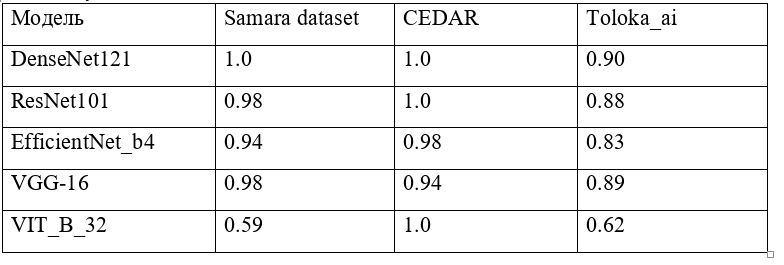

Сводная таблица
Accuracy:


# SAMARA DATASET

## DenseNet
```
Epoch [1/50], Loss: 0.1677 ;  Test Accuracy: 65.38%
Epoch [2/50], Loss: 0.1387 ;  Test Accuracy: 84.62%
Epoch [3/50], Loss: 0.0831 ;  Test Accuracy: 92.31%
Epoch [4/50], Loss: 0.1082 ;  Test Accuracy: 88.46%
Epoch [5/50], Loss: 0.0948 ;  Test Accuracy: 92.31%
Epoch [6/50], Loss: 0.1114 ;  Test Accuracy: 78.85%
....
Epoch [11/50], Loss: 0.0670 ;  Test Accuracy: 96.15%
Epoch [12/50], Loss: 0.0583 ;  Test Accuracy: 98.08%
Epoch [13/50], Loss: 0.0800 ;  Test Accuracy: 94.23%
Epoch [14/50], Loss: 0.0819 ;  Test Accuracy: 96.15%
Epoch [15/50], Loss: 0.0577 ;  Test Accuracy: 100.00%
....
Epoch [49/50], Loss: 0.0074 ;  Test Accuracy: 96.15%
Epoch [50/50], Loss: 0.0022 ;  Test Accuracy: 94.23%
Best acc: 1.0 with corresponding loss: 0.05770856874519
```

## ResNet
```
Number of training samples: 204
Number of validation samples: 52
Epoch [1/35], Loss: 0.6808 ;  Test Accuracy: 71.15%
Epoch [2/35], Loss: 0.3528 ;  Test Accuracy: 86.54%
....
Epoch [34/35], Loss: 0.0448 ;  Test Accuracy: 98.08%
Epoch [35/35], Loss: 0.0063 ;  Test Accuracy: 98.08%
Best acc: 0.9807692307692307 with corresponding loss: 0.001573615412994781
```


## VIT_B_32 / VIT_L_32
```
Epoch [1/25], Loss: 0.8942 ;  Test Accuracy: 55.77%
Epoch [2/25], Loss: 0.9755 ;  Test Accuracy: 55.77%
Epoch [3/25], Loss: 0.8676 ;  Test Accuracy: 44.23%
....
Epoch [21/25], Loss: 0.7589 ;  Test Accuracy: 55.77%
Epoch [22/25], Loss: 0.9284 ;  Test Accuracy: 44.23%
Epoch [23/25], Loss: 0.8635 ;  Test Accuracy: 55.77%
Epoch [24/25], Loss: 0.9514 ;  Test Accuracy: 44.23%
Epoch [25/25], Loss: 0.8807 ;  Test Accuracy: 55.77%
Best acc: 0.5961538461538461 with corresponding loss: 0.8672458567455703
```


## EfficientNet_b4
```
Epoch [1/25], Loss: 0.6885 ;  Test Accuracy: 53.85%
Epoch [2/25], Loss: 0.6518 ;  Test Accuracy: 59.62%
Epoch [3/25], Loss: 0.6309 ;  Test Accuracy: 67.31%
Epoch [4/25], Loss: 0.5994 ;  Test Accuracy: 73.08%
Epoch [5/25], Loss: 0.6000 ;  Test Accuracy: 65.38%
Epoch [6/25], Loss: 0.5801 ;  Test Accuracy: 67.31%
Epoch [7/25], Loss: 0.5424 ;  Test Accuracy: 67.31%
Epoch [8/25], Loss: 0.5410 ;  Test Accuracy: 82.69%
Epoch [9/25], Loss: 0.5220 ;  Test Accuracy: 75.00%
Epoch [10/25], Loss: 0.4761 ;  Test Accuracy: 73.08%
Epoch [11/25], Loss: 0.4522 ;  Test Accuracy: 76.92%
Epoch [12/25], Loss: 0.4654 ;  Test Accuracy: 76.92%
Epoch [13/25], Loss: 0.4404 ;  Test Accuracy: 75.00%
Epoch [14/25], Loss: 0.4094 ;  Test Accuracy: 84.62%
Epoch [15/25], Loss: 0.3909 ;  Test Accuracy: 76.92%
Epoch [16/25], Loss: 0.3522 ;  Test Accuracy: 88.46%
Epoch [17/25], Loss: 0.4345 ;  Test Accuracy: 86.54%
Epoch [18/25], Loss: 0.3611 ;  Test Accuracy: 94.23%
Epoch [19/25], Loss: 0.3499 ;  Test Accuracy: 90.38%
Epoch [20/25], Loss: 0.3602 ;  Test Accuracy: 92.31%
Epoch [21/25], Loss: 0.3118 ;  Test Accuracy: 82.69%
Epoch [22/25], Loss: 0.3354 ;  Test Accuracy: 86.54%
Epoch [23/25], Loss: 0.2953 ;  Test Accuracy: 92.31%
Epoch [24/25], Loss: 0.2625 ;  Test Accuracy: 86.54%
Epoch [25/25], Loss: 0.2179 ;  Test Accuracy: 92.31%
Best acc: 0.9423076923076923 with corresponding loss: 0.0902809407927242
```

## VGG - 16
```
Epoch [1/25], Loss: 0.6497 ;  Test Accuracy: 80.77%
Epoch [2/25], Loss: 0.4520 ;  Test Accuracy: 82.69%
Epoch [3/25], Loss: 0.1762 ;  Test Accuracy: 84.62%
Epoch [4/25], Loss: 0.1288 ;  Test Accuracy: 92.31%
Epoch [5/25], Loss: 0.0567 ;  Test Accuracy: 88.46%
...
Epoch [14/25], Loss: 0.0001 ;  Test Accuracy: 94.23%
Epoch [15/25], Loss: 0.0001 ;  Test Accuracy: 94.23%
Epoch [16/25], Loss: 0.0001 ;  Test Accuracy: 94.23%
Epoch [17/25], Loss: 0.0001 ;  Test Accuracy: 94.23%
Epoch [18/25], Loss: 0.0000 ;  Test Accuracy: 94.23%
Epoch [19/25], Loss: 0.0000 ;  Test Accuracy: 94.23%
Epoch [20/25], Loss: 0.0000 ;  Test Accuracy: 94.23%
Epoch [21/25], Loss: 0.0000 ;  Test Accuracy: 94.23%
Epoch [22/25], Loss: 0.0000 ;  Test Accuracy: 94.23%
Epoch [23/25], Loss: 0.0001 ;  Test Accuracy: 94.23%
Epoch [24/25], Loss: 0.0000 ;  Test Accuracy: 96.15%
Epoch [25/25], Loss: 0.0000 ;  Test Accuracy: 96.15%
Best acc: 0.9807692307692307 with corresponding loss: 0.023145368251369283
```


# CEDAR DATASET
## DenseNet121:
```
Epoch [1/5], Loss: 0.1378 ;  Test Accuracy: 99.81%
Epoch [2/5], Loss: 0.0103 ;  Test Accuracy: 100.00%
Epoch [3/5], Loss: 0.0109 ;  Test Accuracy: 99.62%
Epoch [4/5], Loss: 0.0084 ;  Test Accuracy: 100.00%
Epoch [5/5], Loss: 0.0050 ;  Test Accuracy: 100.00%
```

## EfficientNet_b4
```
Epoch [1/5], Loss: 0.6027 ;  Test Accuracy: 88.26%
Epoch [2/5], Loss: 0.4257 ;  Test Accuracy: 93.56%
Epoch [3/5], Loss: 0.2932 ;  Test Accuracy: 94.51%
Epoch [4/5], Loss: 0.2255 ;  Test Accuracy: 98.48%
Epoch [5/5], Loss: 0.1715 ;  Test Accuracy: 98.30%
```

## VGG-16
```
Epoch [1/25], Loss: 0.5460 ;  Test Accuracy: 48.11%
Epoch [2/25], Loss: 0.6933 ;  Test Accuracy: 51.89%
Epoch [3/25], Loss: 0.6906 ;  Test Accuracy: 51.89%
Epoch [4/25], Loss: 0.6937 ;  Test Accuracy: 51.89%
Epoch [5/25], Loss: 0.6908 ;  Test Accuracy: 51.89%
Epoch [6/25], Loss: 0.6929 ;  Test Accuracy: 48.11%
Epoch [7/25], Loss: 0.6905 ;  Test Accuracy: 48.30%
Epoch [8/25], Loss: 0.6895 ;  Test Accuracy: 48.11%
Epoch [9/25], Loss: 0.6896 ;  Test Accuracy: 51.89%
Epoch [10/25], Loss: 0.6760 ;  Test Accuracy: 56.25%
Epoch [11/25], Loss: 0.6270 ;  Test Accuracy: 71.21%
Epoch [12/25], Loss: 0.6170 ;  Test Accuracy: 58.52%
Epoch [13/25], Loss: 0.6107 ;  Test Accuracy: 72.16%
Epoch [14/25], Loss: 0.5434 ;  Test Accuracy: 78.41%
Epoch [15/25], Loss: 0.5074 ;  Test Accuracy: 67.80%
Epoch [16/25], Loss: 0.4608 ;  Test Accuracy: 84.09%
Epoch [17/25], Loss: 0.3985 ;  Test Accuracy: 81.25%
Epoch [18/25], Loss: 0.3650 ;  Test Accuracy: 86.36%
Epoch [19/25], Loss: 0.2042 ;  Test Accuracy: 94.70%
Epoch [20/25], Loss: 0.5982 ;  Test Accuracy: 52.84%
Epoch [21/25], Loss: 0.4610 ;  Test Accuracy: 82.95%
Epoch [22/25], Loss: 0.3393 ;  Test Accuracy: 86.93%
Epoch [23/25], Loss: 0.2127 ;  Test Accuracy: 93.56%
Epoch [24/25], Loss: 0.2329 ;  Test Accuracy: 91.86%
Epoch [25/25], Loss: 0.1785 ;  Test Accuracy: 93.75%
```

## ResNet101
```
Epoch [1/5], Loss: 0.1673 ;  Test Accuracy: 100.00%
Epoch [2/5], Loss: 0.0138 ;  Test Accuracy: 100.00%
Epoch [3/5]  Loss: 0.0133 ;  Test Accuracy: 100.00%
Epoch [4/5], Loss: 0.0051 ;  Test Accuracy: 100.00%
Epoch [5/5], Loss: 0.0026 ;  Test Accuracy: 100.00%
```

## VIT B 32 (learning rate = 0.0002)
```
Epoch [1/50], Loss: 0.6925 ;  Test Accuracy: 79.36%
Epoch [2/50], Loss: 0.6712 ;  Test Accuracy: 47.92%
Epoch [3/50], Loss: 0.6265 ;  Test Accuracy: 47.92%
Epoch [4/50], Loss: 0.4582 ;  Test Accuracy: 96.97%
Epoch [5/50], Loss: 0.2434 ;  Test Accuracy: 99.62%
Epoch [6/50], Loss: 0.1848 ;  Test Accuracy: 100.00%
Epoch [7/50], Loss: 0.0055 ;  Test Accuracy: 100.00%
Epoch [8/50], Loss: 0.0014 ;  Test Accuracy: 100.00%
Epoch [9/50], Loss: 0.0006 ;  Test Accuracy: 100.00%
...
```


# TOLOKA AI Dataset
## DenseNet121
```
Best acc: 0.90
```
## Resnet101
```
Epoch [1/35], Loss: 0.7712 ;  Test Accuracy: 66.80%
Epoch [2/35], Loss: 0.5377 ;  Test Accuracy: 79.51%
Epoch [3/35], Loss: 0.4263 ;  Test Accuracy: 64.05%
...
Epoch [32/35], Loss: 0.0054 ;  Test Accuracy: 88.50%
Epoch [33/35], Loss: 0.0027 ;  Test Accuracy: 88.66%
Epoch [34/35], Loss: 0.0214 ;  Test Accuracy: 87.37%
Epoch [35/35], Loss: 0.0333 ;  Test Accuracy: 85.67%
Best acc: 0.8866396761133604 with corresponding loss: 0.0013496746879369547
```

## EfficientNet_b4
```
Epoch [1/25], Loss: 0.6573 ;  Test Accuracy: 65.10%
Epoch [2/25], Loss: 0.6170 ;  Test Accuracy: 62.91%
...
Epoch [24/25], Loss: 0.2855 ;  Test Accuracy: 82.91%
Epoch [25/25], Loss: 0.2662 ;  Test Accuracy: 83.00%
Best acc: 0.8299595141700404 with corresponding loss: 0.0665548487679242
```

## VGG - 16
```
Epoch [1/25], Loss: 0.6119 ;  Test Accuracy: 76.36%
Epoch [2/25], Loss: 0.4456 ;  Test Accuracy: 76.28%
...
Epoch [22/25], Loss: 0.0004 ;  Test Accuracy: 88.83%
Epoch [23/25], Loss: 0.0001 ;  Test Accuracy: 88.99%
Epoch [24/25], Loss: 0.0001 ;  Test Accuracy: 89.15%
Epoch [25/25], Loss: 0.0001 ;  Test Accuracy: 89.47%
Best acc: 0.8987854251012146 with corresponding loss: 1.6751097549987063e-05
```

## VIT_B_32
```
Epoch [1/25], Loss: 0.6930 ;  Test Accuracy: 51.98%
Epoch [2/25], Loss: 0.6874 ;  Test Accuracy: 53.12%
...
Epoch [23/25], Loss: 0.6134 ;  Test Accuracy: 59.03%
Epoch [24/25], Loss: 0.6058 ;  Test Accuracy: 62.91%
Epoch [25/25], Loss: 0.5996 ;  Test Accuracy: 58.70%
Best acc: 0.6291497975708502 with corresponding loss: 0.6057827390573399
```