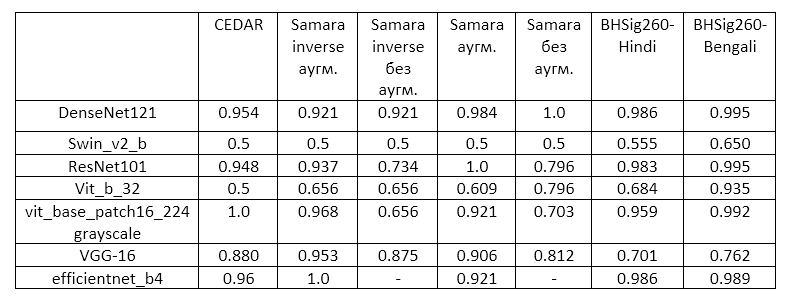
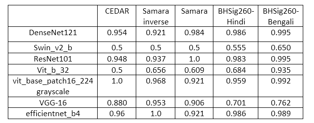
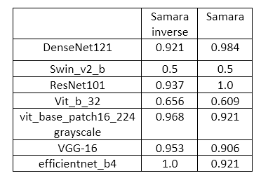
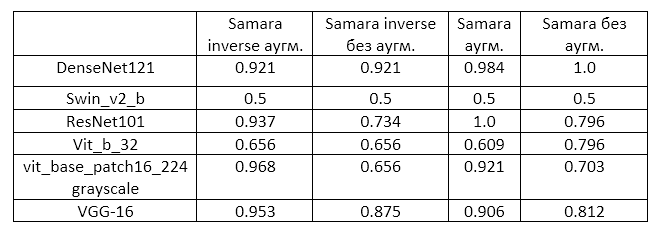

## Ссылки

https://habr.com/ru/articles/737060/ - реализация и объяснение triple loss

https://github.com/davidsandberg/facenet - реализация facenet

https://www.researchgate.net/publication/319284867_Deep_Convolutional_Neural_Network_Using_Triplets_of_Faces_Deep_Ensemble_and_Score-Level_Fusion_for_Face_Recognition?enrichId=rgreq-04ea56ac9083d33fd2aca017fd3ea963-XXX&enrichSource=Y292ZXJQYWdlOzMxOTI4NDg2NztBUzo3OTk2NzEwMjI4MDA4OThAMTU2NzY2NzgzNzI4MA%3D%3D&el=1_x_3&_esc=publicationCoverPdf - тоже работа про triplet loss на лицах

https://blog.fastforwardlabs.com/2021/06/09/deep-metric-learning-for-signature-verification.html - triplet loss, но уже на подписях

https://github.com/divyanshrai/Signature-triplet-loss и https://www.kaggle.com/code/divyanshrai/different-triplet-loss-function-on-signature - triplet-loss, но на подписях и с кодом. Пока что не тестировалось

https://github.com/hrantzsch/signature-embedding - эмбеддинги и triplet-loss для MNIST датасета, но этот проект недоделан для подписей и нужно доделывать его

## Постановка задачи:
Во входных данных имеется N подлинных и (в идеале) столько же N поддельных подписей. В процессе обучения, нейронная сеть должна научиться определять подлинные подписи от поддельных (т.е. задача бинарной классификации).

## Описание баз данных
«Samara» - созданная база данных в процессе выполнения задания. Состоит из 320 подписей, в создании которых принимало участие 10 человек: от каждого из них было собрано по 16 подлинных и 16 поддельных подписей. Каждая подпись была отсканирована с разрешением 300 DPI.

«CEDAR» - одна из самых часто используемых баз данных. На каждого из 55 участников в датасете приходится 24 подлинные и 24 поддельные подписи. Т.е. в базе данных присутствует 1320 подлинных и 1320 поддельных подписей. Каждая подпись была отсканирована с разрешением 300 точек на дюйм (DPI), а также использовалась нормализация и удаление шумов.

«BHSig260» — база данных бенгальского и хинди языков. Для бенгальского в базе данных присутствуют подписи от 100 человек, а от языка хинди — 160. Для каждого человека в базе данных находится 24 подлинных подписи и 30 поддельных. Таким образом, «BHSig260» содержит 6240 подлинных подписей и 7800 поддельных. Каждая подпись сделана с разрешением 300 DPI и форматом TIF. В ходе выполнения экспериментов, подписи бенгальского и хинди языков были разделены, формируя тем самым базы данных «BHSig260-Bengali» и «BHSig260-Hindi».

# Сводная таблица всех экспериментов по метрике Accuracy

## Общее описание экспериментов
Количество эпох варьировалось от 70 до 250 в зависимости от производительности модели и скорости уменьшения Loss функции.

В качестве функции потерь была выбрана CrossEntropyLoss;

Оптимизация производилась с помощью стохастического градиентного спуска с learning rate близким к 1e-4 и momentum в промежутке [0.2;0.9].

Нейронные сети (кроме vit_base_patch16_224) обучались с нуля, без pretrained весов. 

# Эксперимент 1 - сравнение CNN и трансформерных нейросетей

Из данной таблицы видно, что, при обучении с нуля, нейронные сети трансформерного типа (Vit_b_32, Swin_v2_b) справляются хуже с задачей, чем CNN.

Однако заранее натренированная модель ViT трансформера в целом имеет такой же уровень метрик, как и остальные CNN.

Эксперимент проводился следующим образом: каждая из баз данных делилась в соотношении 80/20 для создания обучающей и тестовой выборки соответственно.

К тестовой выборке последовательно применялись следующие преобразования:
- Изменение размера до N x N;
- Вырезка изображения по центру размера L x L;
- Преобразование в тензор и масштабирование значений в диапазон [0; 1] ;
- Нормализация значений к нужным мат.ожиданиям M и среднеквадратическим отклонениям sigma.
Параметры N, L, M и sigma зависят от конкретной модели нейронной сети.
Например, для модели DenseNet121 преобразования будут следующими:
- Изменение размера до 256 x 256 ;
- Вырезка изображения по центру размера 224 x 224;
- Преобразование в тензор и масштабирование значений в диапазон [0; 1] ;
- Нормализация значений к нужным мат.ожиданиям [0.485, 0.456, 0.406] и среднеквадратическим отклонениям [0.229, 0.224, 0.225].

К обучающей выборки последовательно применялись следующие преобразования:
- Изменение размера до N x N;
- Вырезка изображения по центру размера L x L;
- Случайный поворот изображения на значение от 0 до 25 градусов;
- Случайное преобразование изображение в черно-белое с вероятностью 0.1;
- Случайное изменение яркости, контраста и насыщенности изображения в диапазоне [0.8; 1.2];
- Преобразование в тензор и масштабирование значений в диапазон [0; 1] ;
- Добавление гауссовского шума;
- Нормализация значений к нужным мат.ожиданиям M и среднеквадратическим отклонениям sigma.

Единственное исключение - модель vit_base_patch16_224, у которой каждое изображение на входе было преобразовано к grayscale, а сама модель была переделана так, чтобы количество входных каналов было 1 вместо 3.

# Эксперимент 2 - инвертирование цветов на фотографии

Инвертирование цветов на фотографии заключается в замене фона белого листа на черный, а чернила ручки (синие или черные) - на белый.
Процедура производилась с помощью пороговой обработки и медианного фильтра размером 2x2.

Из результатов видно, что разница оказалась минимальной и данный способ не помог увеличить метрику Swin_v2_b.

# Эксперимент 3 - использование аугментаций

Более подробное описание:

"аугм." означает, что к обучающей и тестовой выборкам применяются такие же преобразования, как и в эксперименте №1.
"без аугм." означает, что к обеим выборкам применялись лишь следующие преобразования:
- Изменение размера до N x N;
- Вырезка изображения по центру размера L x L;
- Преобразование в тензор и масштабирование значений в диапазон [0; 1] ;
- Нормализация значений к нужным мат.ожиданиям M и среднеквадратическим отклонениям sigma.

Из результатов видно, что при использовании аугментаций модели обладают лучшей обобщающей способностью. 

